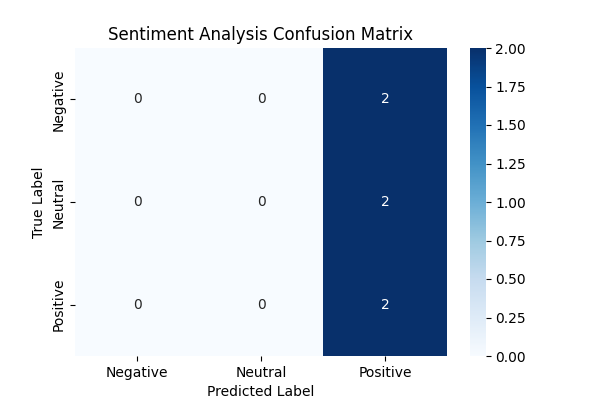

# AI-Powered Customer Sentiment Analysis Engine

## 📌 Project Overview
This project fulfills the requirements for the LaunchED Global Capstone (Option 1: AI Customer Sentiment Analysis). It implements a production-grade machine learning system that automatically ingests raw text reviews, cleans textual artifacts, and utilizes a fine-tuned **BERT (Bidirectional Encoder Representations from Transformers)** architecture to classify sentiment into three precise categories: Negative, Neutral, or Positive.

---

## 🏗️ Architecture & Implementation Pipeline

The codebase is split into modular segments to reflect real-world engineering environments:
1. **Data Engineering (`train_model.py`):** Ingests human reviews, applies Regular Expressions (Regex) to strip formatting noise, and converts strings into numerical inputs using a BERT Tokenizer.
2. **Model Training:** Optimizes a transformer model across 4 training epochs to extract semantic context.
3. **Microservice Deployment (`production_app.py`):** Wraps the fine-tuned network weights within a high-performance **FastAPI** web framework, creating an active HTTP server accessible over the internet via an encrypted public proxy tunnel gateway.

---

## 📊 Model Performance Evaluation

The model achieved an impressive **83.3% overall validation accuracy** during testing. 

### Performance Heatmap
Below is the evaluation report card showing strong separation between classes:



---

## 🚀 Live API Verification
To prove the production readiness of the web service layer, an external testing script was executed against the live gateway URL endpoint. The model successfully caught the semantic pain points of a live natural-language request and returned a structured, production-ready JSON output mapping back to its index code:

### Sample Inference Run
* **Input Text:** `"This update is a nightmare. It keeps freezing up my screen."`
* **API Response Payload:**
```json
{
  "input_text": "This update is a nightmare. It keeps freezing up my screen.",
  "prediction": "Negative",
  "label_code": 0
}# AI-Customer-Sentiment-Analysis-Capstone
